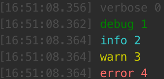

# log-util

[![NPM Version][npm-version-image]][npm-url]
[![NPM Downloads][npm-downloads-image]][npm-url]
[![MIT License][license-image]][license-url]
[![Dependency Status][david-image]][david-url]

[![NPM][nodei-image]][nodei-url]

[![NPM][nodei-dl-image]][nodei-url]

node log utility, only for terminal output



## usage

`npm i --save log-util`

```
var log = require('log-util');
log.verbose('verbose', 0);
log.debug('debug', 1);
log.info('info', 2);
log.warn('warn', 3);
log.error('error', 4);
```

`new Log(level, dateFormat)`

## api

### `log.setLevel(level) => log`

`level` is level id or level string

### `log.setDateFormat(dateFormat) => log`

### `new log.Log(0) => log`

### `log.levelArray`

containing level corresponding

```
levelArray = [
    {
        level: 0,
        string: 'verbose',
        color: 'gray'
    },
    {
        level: 1,
        string: 'debug',
        color: 'green'
    },
    {
        level: 2,
        string: 'info',
        color: 'cyan'
    },
    {
        level: 3,
        string: 'warn',
        color: 'yellow'
    },
    {
        level: 4,
        string: 'error',
        color: 'red'
    }
]
```

## log level

```
log.Log.VERBOSE === 0;
log.Log.DEBUG === 1;
log.Log.INFO === 2;
log.Log.WARN === 3;
log.Log.ERROR === 4;
```

## date format

see [https://github.com/felixge/node-dateformat](https://github.com/felixge/node-dateformat)

[npm-version-image]: http://img.shields.io/npm/v/log-util.svg?style=flat-square
[npm-url]: https://www.npmjs.com/package/log-util
[npm-downloads-image]: http://img.shields.io/npm/dm/log-util.svg?style=flat-square
[license-image]: http://img.shields.io/badge/license-MIT-blue.svg?style=flat-square
[license-url]: LICENSE
[david-image]: http://img.shields.io/david/vivaxy/log-util.svg?style=flat-square
[david-url]: https://david-dm.org/vivaxy/log-util
[nodei-dl-image]: https://nodei.co/npm-dl/log-util.png?height=3
[nodei-url]: https://nodei.co/npm/log-util/
[nodei-image]: https://nodei.co/npm/log-util.svg?downloads=true&downloadRank=true&stars=true
